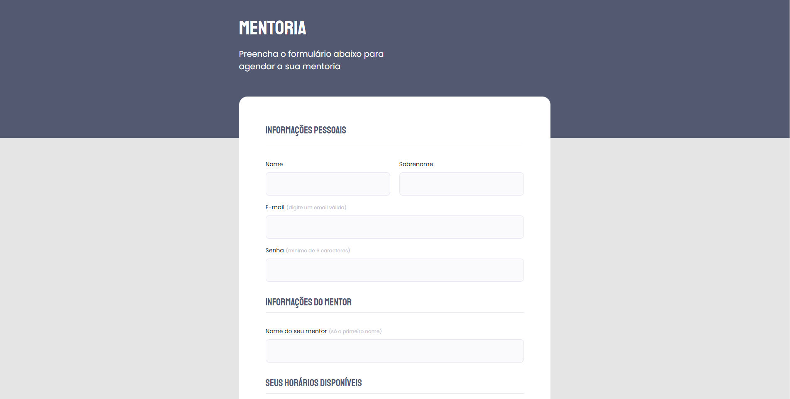

<h1 align="center">
  Formulários de Avaliação
</h1>

<h2 align="center" >Descrição do Projeto</h2>

Os Formulários de Avaliação são o 2° desafio do Stage 03 do programa Explorer | Rockeseat.

 

   

    O Desafio tem como principal objetivo realizar a construção de um formulário totalmente do zero, apenas baseado em um protótipo passado pelo Figma, utilizando os conhecimentos adquiridos nas aulas do nível   03. 
    Agradecimentos infinitos a RocketSeat e ao Mestre <a href="https://github.com/maykbrito">Mayk Brito</a>.

  

   
   

      
  

  

   
  

  
   
  
## 🔗 Link da aplicação no ar: https://mentoria.netlify.app/ && https://mentoria-avaliacao.netlify.app/
  
## :rocket: Tecnologias

Esse projeto foi desenvolvido com as seguintes tecnologias e técnicas:

✔️ HTML

✔️ Forms, Inputs e Selects

✔️ CSS

✔️ Flex-box

✔️ Mobile-First

<a href="https://github.com/Dev-Shinsei">
 
  
 <b>Carlos Gomes</b></a> <a href="https://github.com/Dev-Shinsei" title="Github">🚀</a>

Feito com ❤️ por Carlos Gomes 👋
